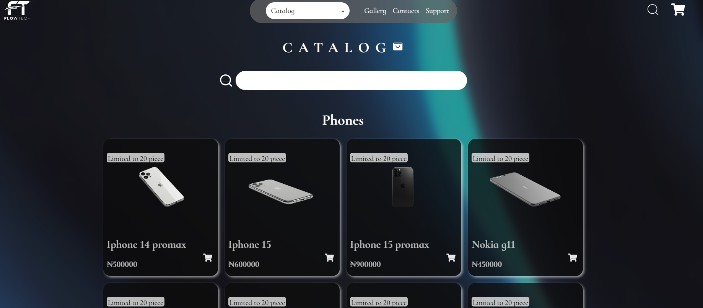
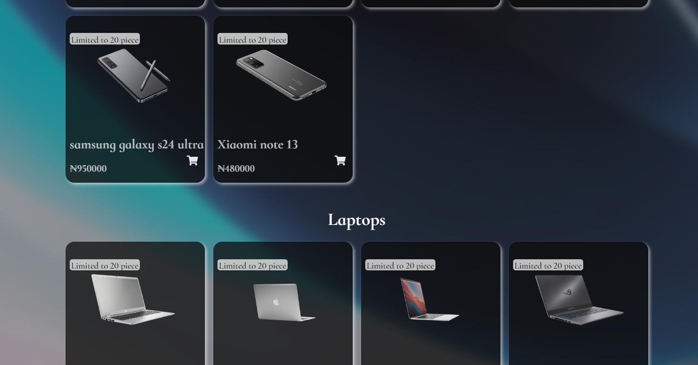
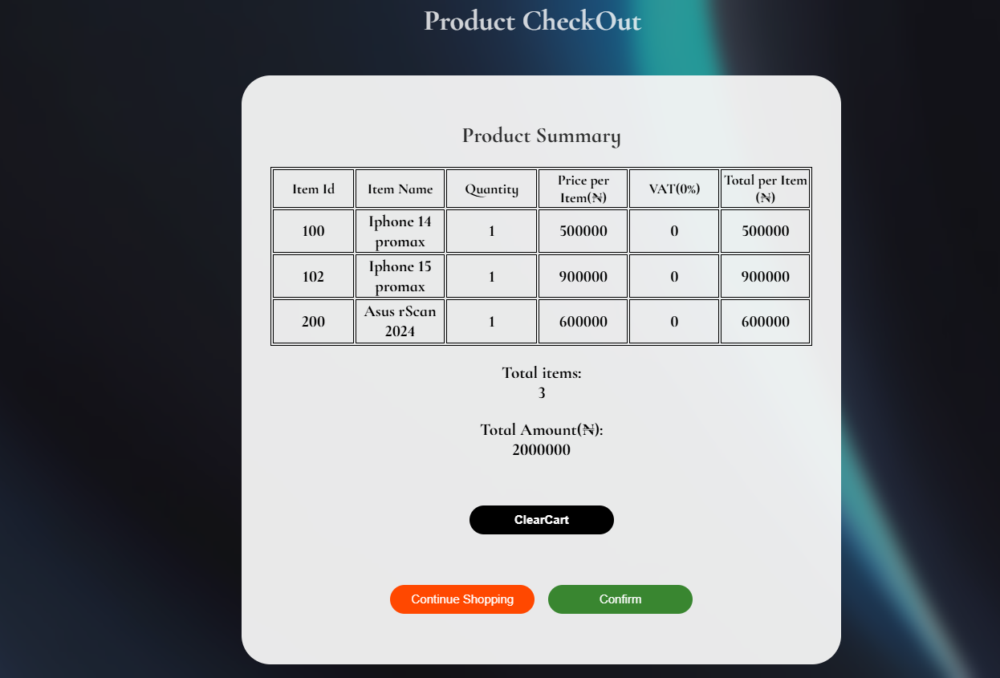
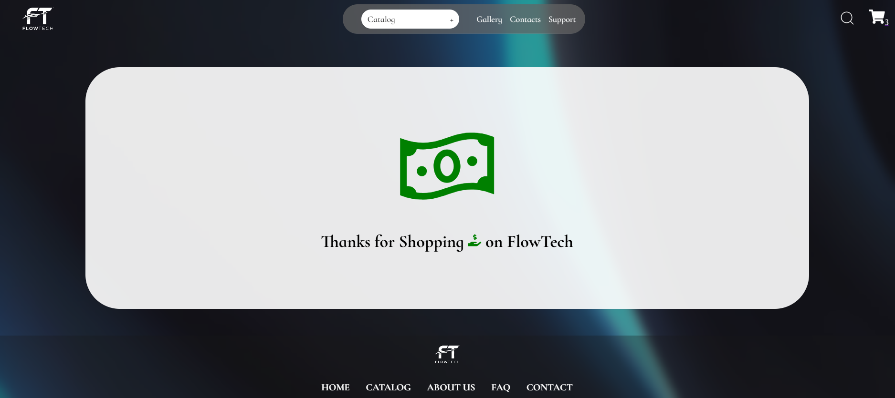
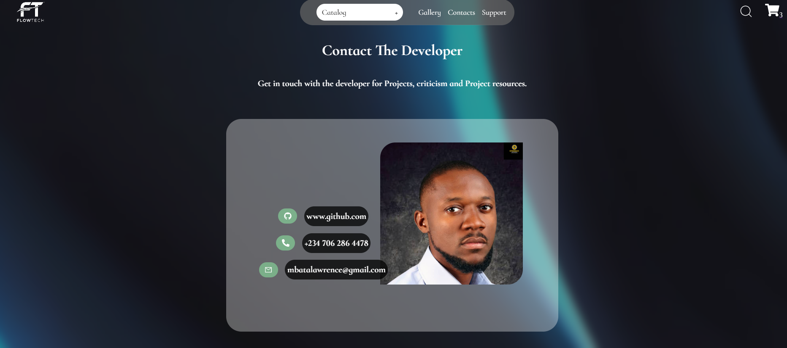

# FullStack E-commerce Website - PERN STACK
Welcome to this e-commerce website project! This Platform is an e-commerce solution built using the PERN stack
(Postgres, Express, React and Node). the design of this project showcase a seamless online shopping experience for users, complete with simple broduct browsing and standard cart manangement.
The project though not elaborate showcases the comprehensive interation of the tools and frameworks.
The readMe file provides a detailed overview of the project, its features, setup instructions and other relevant information to help you understand, navigate and contribute to the e-commerce project. 


## Table of Content
1. Project Overview
2. Technologies
3. Setup Instructions
4. API endPoints
5. Project ScreenShots
6. Acknowledgments


## Project Overview 
The e-commerce website is a modern, scalable online shopping platform. The platform is a technology device merchant that has a portfolio of various products ranging from phones to laptops and other accessories. 
The platform allows users to browse products by category and search for a specific product, it also has cart functionality to be able to add products and remove product. By extension it has a checkout menu that sums up consumers products and its billing.
NOTE: The Platform is not mobile friendly as it only carters to large screen users.

The projectis divided into two components:
+ Frontend: Built with React.js, the frontend provides a dynamic and interactive user interface.
+ Backend: Powered by Node.js and Express.js, the backend handles API requests, database interactions, and business logic.

+ Database: PostgreSQL is used as the relational database mainly to store product information.

## Technologies
### FrontEnd

| Technology   | Description |
| ------------ | ----------- |
| React.js  | JavaScript library for building the user interface.   |
| React-Router | For client-side routing.     |
| Context API    | State management for managing global application state.   |
| Axios    | For making HTTP requests to the backend.   |
| CSS   | For styling.   |

### BackEnd

| Technology   | Description |
| ------------ | ----------- |
| Node.js  | JavaScript runtime for server-side development.  |
| Express.js | Web framework for building RESTful APIs.  |
| Postgres    |  Relational database for storing data.  |

### Tools

| Technology   | Description |
| ------------ | ----------- |
| Git | Version control system.  |
| PostMan |  For testing API endpoints. |


## Setup Instructions
### Prerequisites
The latest versions
+ Node.js
+ Postgres
+ Git

### Instructions
1. Clone This repo
```
git clone https://github.com/dilawrenzo77/FullStack_E-commerce_Website_PERN_STACK.git
```
2. Navigate to the backend folder and Install Dependencies
```
cd server

npm install
```
3. Start the Backend Development Server(At PORT: 3000)
```
nodemon server.js
```
4. Set Up the Database

+Create a PostgreSQL database and update the config/config.json file in the backend folder with your database credentials.

+Run migrations to create tables:
```
cd ../backend
npx sequelize-cli db:migrate
```
5. Set Up Environment Variables

+Create a .env file in the backend folder and add the following variables:
```
PORT=5000
DB_USER=your_db_user
DB_PASSWORD=your_db_password
DB_NAME=your_db_name
```
6. Navigate to the frontEnd and Install 

```
cd client

npm install

```
7. Start the Frontend Development Server(at PORT:3001)
```
npm start
```
8. Access application
```
http://localhost:3001
```


## API endPoints
A single endPoint was use to generate all the products and was imported and passed round using Context API and useState hook.
+ GET "/allProducts" - Get all products.

## Products ScreenShots
These are the screenshot images of the design of the web Project.

#### Hero Section


#### Featured Products


#### Featured Collections


#### Catalog





#### Cart Inspection


#### Checkout


#### Confirmation


#### Client Reviews


#### Footer


#### Contacts


## Acknowledgments
Special thanks to the open-source community for providing the tools and libraries used in this project.

Inspired by modern e-commerce platforms like Amazon and Shopify."# -FullStack-E-commerce-Website-PERNSTACK" 
"# -FullStack-E-commerce-Website-PERNSTACK" 
"# FullStack-E-commerce-Website-PERN-Stack" 
